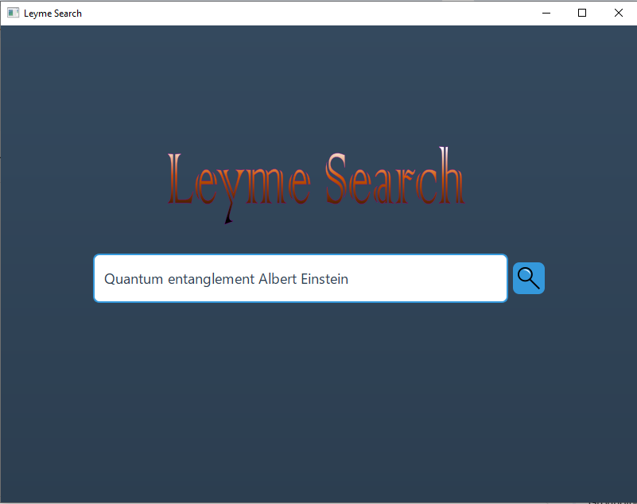
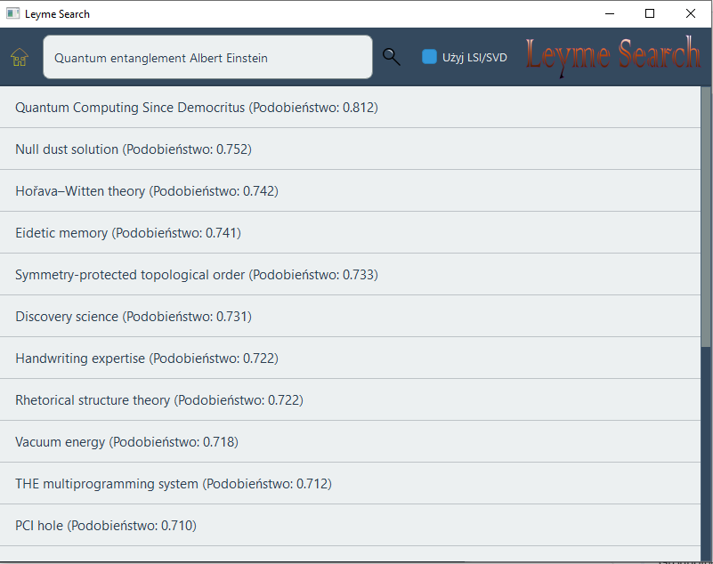
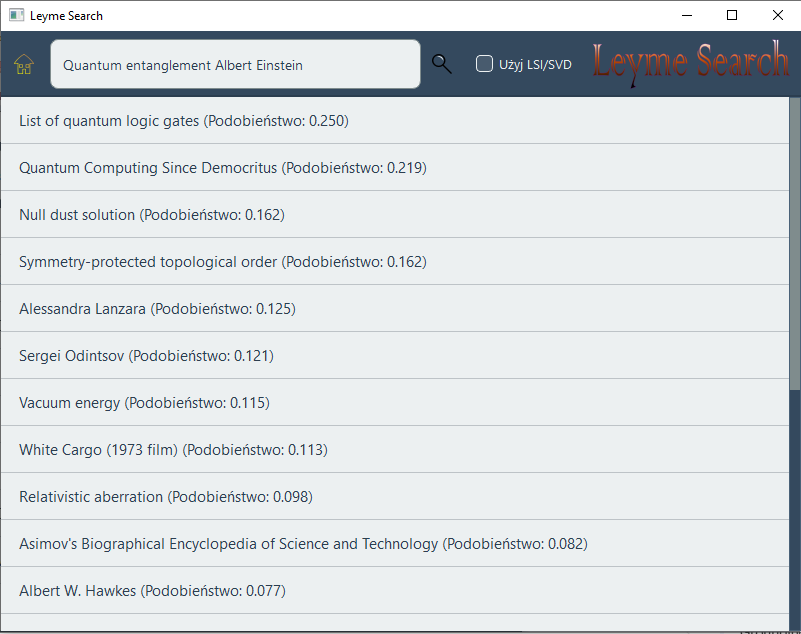
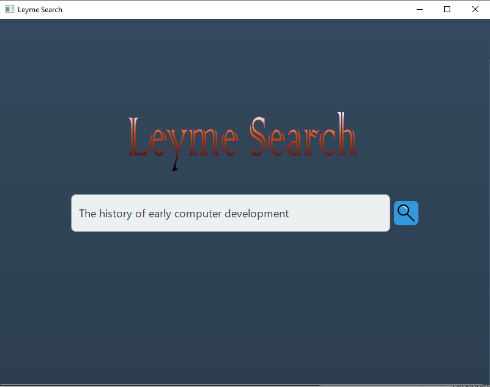
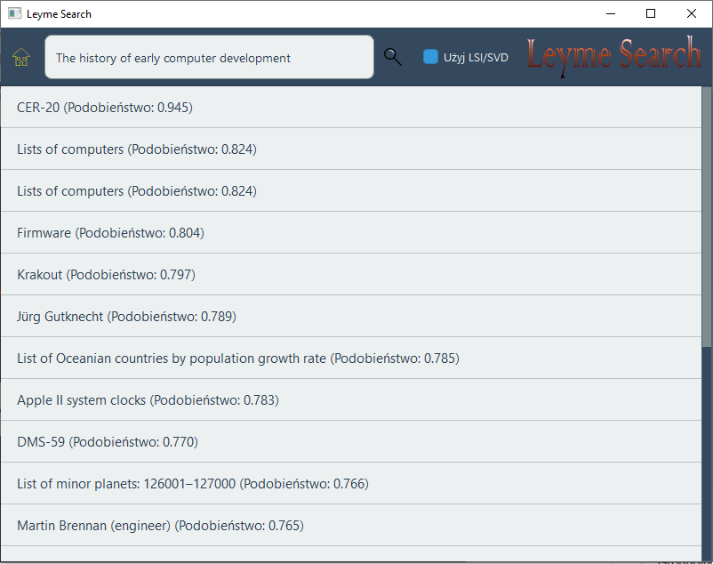
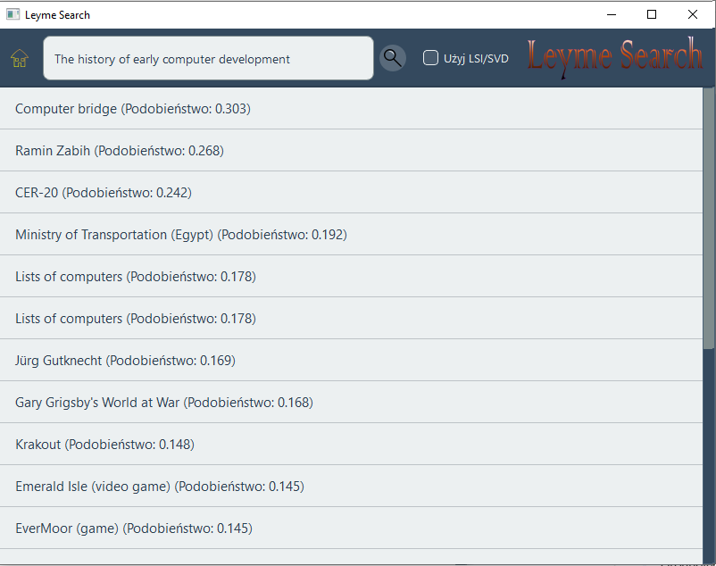

# Simple Browser Project
###### by: Szymon Kłodowski
## Spis treści
1.  [Wstęp](#Wstęp)
2.  [Funkcjonalności](#funkcjonalności)
3.  [Użycie](#użycie)
    *   [1. Przetwarzanie danych (`wikipedia_data_processor`)](#1-przetwarzanie-danych-wikipedia_data_processor)
    *   [2. Przeglądarka wyszukiwania (`Browser`)](#2-przeglądarka-wyszukiwania-browser)
4.  [Przykładowe użycie](#Przykładowe-Wyszukiwania-i-Obserwacje)
5.  [Zależności](#zależności)
6.  [Budowanie projektu](#budowanie-projektu)
7.  [Struktura projektu](#struktura-projektu)

## Wstęp

Leyme Search to aplikacja wyszukiwarki w C++, stworzona jako zadanie na kursie "Metody Obliczeniowe w Nauce i Technice", w szczególności dla Laboratorium 6 skupiającego się na zastosowaniach dekompozycji według wartości osobliwych (SVD).

Projekt implementuje wyszukiwarkę zdolną do wykonywania zapytań na kolekcji dokumentów tekstowych (artykułów z Wikipedii) przy użyciu dwóch głównych technik:
1.  **TF-IDF (Term Frequency-Inverse Document Frequency):** Klasyczny model przestrzeni wektorowej dla wyszukiwania informacji.
2.  **LSI (Latent Semantic Indexing - Utajone Indeksowanie Semantyczne):** Zaawansowana technika wykorzystująca dekompozycję SVD do identyfikacji ukrytych struktur semantycznych w danych, mająca na celu poprawę wyników wyszukiwania poprzez obsługę synonimii i polisemi.

Składa się z dwóch głównych komponentów:
*   `wikipedia_data_processor`: Narzędzie wiersza poleceń do pobierania artykułów z Wikipedii, ich przetwarzania (tokenizacja, budowa macierzy TF-IDF) oraz opcjonalnego wykonania SVD.
*   `Browser`: Graficzny interfejs użytkownika (GUI) oparty na Qt6 do ładowania przetworzonych danych i wykonywania wyszukiwań.

## Funkcjonalności

### Przetwarzanie danych (`wikipedia_data_processor`)
*   Pobiera losowe artykuły z API angielskiej Wikipedii.
*   Zarządza lokalną pamięcią podręczną artykułów w katalogu `wikipedia_articles/`.
*   Tokenizuje tekst artykułów i usuwa popularne angielskie słowa stopu (stopwords).
*   Buduje słownik unikalnych terminów.
*   Konstruuje macierz częstotliwości terminów (TF).
*   Oblicza odwrotną częstotliwość dokumentów (IDF) dla każdego terminu.
*   Buduje ważoną TF-IDF macierz termin-dokument (rzadką).
*   Opcjonalnie wykonuje SVD na macierzy TF-IDF przy użyciu biblioteki [Spectra](https://github.com/yixuan/spectra) w celu uzyskania macierzy `U_k`, `S_k`, `V_k` dla LSI.
*   Zapisuje wszystkie przetworzone dane (słownik, listy dokumentów, macierz TF-IDF, wektor IDF oraz komponenty SVD, jeśli zostały wygenerowane) do plików binarnych i tekstowych.

### Przeglądarka wyszukiwania (GUI - `Browser`)
*   Ładuje wstępnie przetworzone dane wyszukiwarki (słownik, TF-IDF, komponenty SVD).
*   Zapewnia przyjazny dla użytkownika interfejs do wprowadzania zapytań wyszukiwania.
*   Umożliwia użytkownikom przełączanie między wyszukiwaniem TF-IDF a wyszukiwaniem opartym na LSI (jeśli dostępne są dane SVD).
*   Wyświetla wyniki wyszukiwania, w tym tytuły artykułów i ich wyniki podobieństwa cosinusowego do zapytania.
*   Otwiera odpowiedni artykuł Wikipedii w domyślnej przeglądarce internetowej systemu po kliknięciu elementu wyniku.
*   Posiada nowoczesny, stylizowany interfejs użytkownika wykorzystujący Qt i ikony SVG dla przyjemnego doświadczenia użytkownika.

## Użycie

Projekt obejmuje dwuetapowy proces: przetwarzanie danych, a następnie korzystanie z przeglądarki wyszukiwania.

### 1. Przetwarzanie danych (`wikipedia_data_processor`)

To narzędzie wiersza poleceń pobiera artykuły, przetwarza je i generuje niezbędne pliki danych dla wyszukiwarki.
Uruchom je z głównego katalogu projektu (lub dowolnego katalogu, w którym chcesz wygenerować pliki danych, ponieważ `Browser` będzie ich oczekiwać w swoim katalogu roboczym).

**Składnia:**
```bash
# Z wnętrza katalogu 'build':
./wikipedia_data_processor [liczba_artykulow] [--svd [wartosc_k]]
# W systemie Windows:
.\wikipedia_data_processor.exe [liczba_artykulow] [--svd [wartosc_k]]
```

*   `[liczba_artykulow]` (opcjonalnie): Docelowa całkowita liczba artykułów dostępnych do przetworzenia.
    *   Domyślnie `20`.
    *   Jeśli lokalnie (w `wikipedia_articles/`) istnieje mniej artykułów, nowe zostaną pobrane z Wikipedii, aby osiągnąć tę liczbę.
    *   Jeśli lokalnie istnieje więcej artykułów niż ta liczba, lista zostanie skrócona do tej liczby na potrzeby kolejnych etapów przetwarzania (TF-IDF, SVD).
*   `--svd` (opcjonalnie): Jeśli obecne, wykonuje dekompozycję SVD na macierzy TF-IDF w celu wygenerowania danych LSI.
*   `[wartosc_k]` (opcjonalnie, wymaga `--svd`): Liczba wartości/wektorów osobliwych (`k`) do obliczenia dla LSI.
    *   Domyślnie `100`.

**Pliki wyjściowe (generowane w bieżącym katalogu roboczym procesora):**
*   `wikipedia_articles/` (katalog): Zawiera pobrane pliki tekstowe artykułów z Wikipedii.
*   `doc_metadata.tsv`: Plik rozdzielany tabulatorami, mapujący nazwy plików na dysku na oryginalne tytuły z Wikipedii.
*   `vocabulary.txt`: Lista unikalnych terminów, jeden na linię.
*   `doc_disk_filenames.txt`: Lista nazw plików (z `wikipedia_articles/`) użytych w macierzach, jedna na linię.
*   `doc_original_titles.txt`: Lista oryginalnych tytułów z Wikipedii odpowiadających `doc_disk_filenames.txt`.
*   `tdm_tfidf_sparse.dat`: Macierz termin-dokument TF-IDF (rzadka macierz Eigen, format binarny).
*   `idf_vector.dat`: Wartości IDF dla każdego terminu w słowniku (wektor Eigen, format binarny).
*   `U_k.dat`, `S_k_diag.dat`, `V_k.dat` (jeśli użyto `--svd`): Komponenty SVD (gęste macierze/wektor Eigen, format binarny).

**Przykłady:**

*   Przetwórz do 1000 artykułów i wykonaj SVD z `k=150`:
    ```bash
    ./build/wikipedia_data_processor 1000 --svd 150
    ```
*   Przetwórz do 50 artykułów, bez wykonywania SVD:
    ```bash
    ./build/wikipedia_data_processor 50
    ```
    (Upewnij się, że uruchamiasz to z katalogu, w którym chcesz te pliki, np. główny katalog projektu, lub skopiuj je tam, gdzie będzie uruchamiany `Browser`.)

### 2. Przeglądarka wyszukiwania (`Browser`)

Po pomyślnym wygenerowaniu plików danych przez procesor danych, możesz uruchomić aplikację `Browser`.
Oczekuje ona, że wszystkie wymienione powyżej pliki danych (np. `vocabulary.txt`, `tdm_tfidf_sparse.dat` itp.) będą znajdować się w jej **katalogu roboczym** (tj. katalogu, z którego uruchamiasz plik wykonywalny `Browser`).

**Aby uruchomić:**
Navigate to your build directory (e.g., `build/` or `build/Release/`) and execute `Browser`.

```bash
# Z wnętrza katalogu 'build', zakładając, że pliki danych są również w 'build/'
./Browser
# W systemie Windows:
.\Browser.exe
```
Jeśli uruchomiłeś `wikipedia_data_processor` z głównego katalogu projektu, możesz chcieć skopiować wygenerowane pliki danych i katalog `wikipedia_articles` do katalogu `build` przed uruchomieniem `Browser` stamtąd, lub uruchomić `Browser` z głównego katalogu projektu, jeśli twój system budowania umieszcza tam plik wykonywalny.

Aplikacja spróbuje załadować dane przy uruchomieniu.
*   Jeśli pliki danych SVD (`U_k.dat`, `S_k_diag.dat`, `V_k.dat`) zostaną znalezione i będą prawidłowe, pole wyboru "Użyj LSI/SVD" zostanie włączone, umożliwiając przełączenie na wyszukiwanie oparte na LSI. W przeciwnym razie dostępne będzie tylko wyszukiwanie TF-IDF.
*   Wprowadź zapytanie w pasku wyszukiwania i naciśnij Enter lub kliknij przycisk wyszukiwania.
*   Wyniki zostaną wyświetlone. Kliknięcie wyniku spowoduje próbę otwarcia odpowiedniej strony Wikipedii w przeglądarce internetowej.

## Przykładowe Wyszukiwania i Obserwacje

Poniżej przedstawiono wyniki dla kilku przykładowych zapytań, porównując działanie wyszukiwarki w trybie TF-IDF (opcja "Użyj LSI/SVD" odznaczona) oraz LSI/SVD (opcja zaznaczona). Przetwarzanie danych zostało wykonane na korpusie **10 000 artykułów** z Wikipedii, a dla dekompozycji SVD użyto **k=100** wymiarów.

### Zapytanie 1: "Quantum entanglement Albert Einstein"

*   **Strona początkowa:**
     <!-- ZASTĄP URL -->

*   **Wyniki TF-IDF (LSI/SVD odznaczone):**
     <!-- ZASTĄP URL -->
    *   Najwyżej ocenione wyniki to:
        *   "Quantum Computing Since Democritus (Podobieństwo: 0.812)"
        *   "Null dust solution (Podobieństwo: 0.752)"
        *   "Hořava–Witten theory (Podobieństwo: 0.742)"
    *   Obserwacje: Wyniki wydają się być związane z fizyką i obliczeniami kwantowymi, ale niekoniecznie bezpośrednio ze splątaniem kwantowym i Albertem Einsteinem jako głównym tematem. Wysokie wartości podobieństwa sugerują, że terminy z zapytania (lub ich części) występują w tych dokumentach.

*   **Wyniki LSI/SVD (LSI/SVD zaznaczone):**
     <!-- ZASTĄP URL -->
    *   Najwyżej ocenione wyniki to:
        *   "List of quantum logic gates (Podobieństwo: 0.250)"
        *   "Quantum Computing Since Democritus (Podobieństwo: 0.219)"
        *   "Null dust solution (Podobieństwo: 0.162)"
        *   Niżej pojawia się "Albert W. Hawkes (Podobieństwo: 0.077)"
    *   Obserwacje: Wartości podobieństwa są znacznie niższe niż w przypadku TF-IDF. "List of quantum logic gates" jest tematycznie powiązane z "quantum". "Quantum Computing Since Democritus" nadal się pojawia, ale z niższym wynikiem. Pojawienie się "Albert W. Hawkes" może być wynikiem wychwycenia przez LSI słowa "Albert", ale kontekst jest inny.

*   **Wnioski dla Zapytania 1:**
    W tym przypadku TF-IDF zwróciło dokumenty z wyższymi wskaźnikami podobieństwa, które były ogólnie związane z fizyką kwantową. LSI/SVD również znalazło powiązane tematycznie dokumenty, ale z niższymi wskaźnikami podobieństwa. Wydaje się, że dla tak specyficznego zapytania z wieloma kluczowymi terminami, TF-IDF może lepiej identyfikować dokumenty zawierające te konkretne terminy. Niższe wyniki LSI mogą sugerować, że rzutowanie na 100-wymiarową przestrzeń semantyczną nie uchwyciło w pełni specyfiki tego wieloczłonowego zapytania w odniesieniu do dostępnych dokumentów.

### Zapytanie 2: "The history of early computer development"

*   **Strona początkowa:**
     <!-- ZASTĄP URL -->

*   **Wyniki TF-IDF (LSI/SVD odznaczone):**
     <!-- ZASTĄP URL -->
    *   Najwyżej ocenione wyniki to:
        *   "CER-20 (Podobieństwo: 0.945)"
        *   "Lists of computers (Podobieństwo: 0.824)" (dwukrotnie)
        *   "Firmware (Podobieństwo: 0.804)"
    *   Obserwacje: TF-IDF znajduje konkretne przykłady wczesnych komputerów ("CER-20") oraz ogólne listy komputerów, co jest bardzo trafne. Wyniki podobieństwa są wysokie.

*   **Wyniki LSI/SVD (LSI/SVD zaznaczone):**
     <!-- ZASTĄP URL -->
    *   Najwyżej ocenione wyniki to:
        *   "Computer bridge (Podobieństwo: 0.303)"
        *   "Ramin Zabih (Podobieństwo: 0.268)"
        *   "CER-20 (Podobieństwo: 0.242)"
    *   Obserwacje: Ponownie, wartości podobieństwa są znacznie niższe. "CER-20" nadal jest obecny, ale z dużo niższym wynikiem. "Computer bridge" wydaje się mniej trafny.

*   **Wnioski dla Zapytania 2:**
    Podobnie jak w poprzednim przypadku, TF-IDF wydaje się dostarczać bardziej bezpośrednio trafne wyniki z wyższymi wskaźnikami podobieństwa dla tego zapytania. Zastosowanie LSI/SVD z k=100 mogło spowodować zbyt dużą generalizację dla tego konkretnego zapytania, tracąc część specyfiki dobrze uchwyconej przez TF-IDF.

### Ogólne Wnioski z Przykładów (korpus 10 000 dokumentów, k=100)

Na podstawie tych dwóch przykładów dla korpusu 10 000 artykułów i k=100 dla SVD, można zaobserwować, że:
1.  **TF-IDF** konsekwentnie zwracało wyniki z wysokimi wskaźnikami podobieństwa, gdy terminy z zapytania były bezpośrednio obecne w dokumentach. Wykazało dużą skuteczność dla precyzyjnych zapytań, które polegają na dopasowaniu konkretnych słów kluczowych.
2.  **LSI/SVD (k=100)** w tych konkretnych przypadkach prowadziło do znacznie niższych wskaźników podobieństwa w porównaniu do TF-IDF. Chociaż celem LSI jest uchwycenie ukrytych zależności semantycznych, wartość k=100 dla tak dużego i zróżnicowanego korpusu może być relatywnie niska, prowadząc do dużej kompresji informacji i potencjalnej utraty subtelnych różnic, które są ważne dla specyficznych zapytań.
3.  Przy k=100, LSI mogło "uśrednić" znaczenia do tego stopnia, że specyficzne kombinacje terminów (jak w "Quantum entanglement Albert Einstein") nie znalazły silnego odzwierciedlenia w zredukowanej przestrzeni. Wektory dokumentów i zapytań mogły zostać rzutowane na obszary przestrzeni LSI, które są zbyt ogólne.
4.  Możliwe, że dla uzyskania lepszych wyników z LSI na tym korpusie należałoby eksperymentować z **większymi wartościami `k`** (np. 200, 300, a nawet więcej), aby zachować więcej informacji semantycznej, jednocześnie redukując szum. Niższe `k` może być bardziej odpowiednie dla mniejszych lub bardziej jednorodnych tematycznie korpusów.
5.  Obserwowane wyniki nie wykluczają, że LSI z k=100 mogłoby lepiej radzić sobie z zapytaniami testującymi synonimię (np. wyszukiwanie "samochód", a znalezienie "auto") lub polisemię, gdzie TF-IDF mógłby mieć problemy. Prezentowane zapytania były dość specyficzne.
6.  Niskie wartości podobieństwa w LSI niekoniecznie oznaczają złe wyniki – ranking (kolejność) jest często ważniejszy. Jednak tak duża różnica w skali podobieństwa w porównaniu do TF-IDF jest zauważalna.

Należy podkreślić, że są to obserwacje oparte na ograniczonym zestawie przykładów. Pełna ocena wymagałaby bardziej systematycznych testów na większym zbiorze zapytań, analizy jakościowej zwróconych dokumentów oraz eksperymentów z różnymi wartościami `k` dla SVD. Użycie k=100 dla 10 000 dokumentów jest tylko jednym z wielu możliwych ustawień.

## Zależności
Aby zbudować i uruchomić ten projekt, będziesz potrzebować:
*   **CMake** (wersja 3.20 lub nowsza)
*   **Kompilator zgodny z C++20** (np. GCC, Clang, MSVC)
*   **Qt6** (w tym moduły Core, Gui, Widgets, Network, Svg, SvgWidgets)
*   **Eigen3** (biblioteka algebry liniowej)
*   **libCURL** (do pobierania danych w `wikipedia_data_processor`)
*   **Spectra** (biblioteka header-only do SVD, w rozwoju użyto wersji 1.1.0). Będziesz musiał ją pobrać i podać ścieżkę do jej katalogu `include` dla CMake poprzez `SPECTRA_INCLUDE_DIR`.
*   **nlohmann/json** (do parsowania JSON w `wikipedia_data_processor`). Upewnij się, że `nlohmann/json.hpp` jest dostępny w ścieżkach include twojego kompilatora (np. instalacja systemowa lub umieszczenie go w katalogu include dostępnym dla projektu).
*   Standardowa biblioteka C++ z obsługą `<filesystem>` (dla `stdc++fs`).

## Budowanie projektu

1.  **Sklonuj repozytorium:**
    ```bash
    git clone <adres-url-repozytorium>
    cd <katalog-repozytorium>
    ```

2.  **Upewnij się, że wszystkie zależności są zainstalowane.**
    *   Dla **Spectra**: Pobierz ją (np. z [Spectra Releases](https://github.com/yixuan/spectra/releases)). Zanotuj ścieżkę do jej katalogu `include`.
    *   Dla **nlohmann/json**: Pobierz `json.hpp` z [nlohmann/json releases](https://github.com/nlohmann/json/releases) i umieść go tam, gdzie kompilator może go znaleźć, lub zainstaluj systemowo, jeśli twój menedżer pakietów to obsługuje.

3.  **Skonfiguruj i zbuduj za pomocą CMake:**
    Utwórz katalog budowania i uruchom CMake, podając ścieżkę do katalogu `include` biblioteki Spectra.

    ```bash
    mkdir build
    cd build

    # Dla Linux/macOS:
    cmake .. -DSPECTRA_INCLUDE_DIR=/sciezka/do/twojego/spectra-1.1.0/include
    make -j$(nproc) # lub cmake --build .

    # Dla Windows (np. z Visual Studio 2022):
    # Otwórz CMake GUI lub użyj wiersza poleceń:
    # cmake .. -G "Visual Studio 17 2022" -A x64 -DSPECTRA_INCLUDE_DIR=D:/sciezka/do/twojego/spectra-1.1.0/include
    # cmake --build . --config Release
    ```
    Zastąp `/sciezka/do/twojego/spectra-1.1.0/include` rzeczywistą ścieżką do katalogu `include` Spectra na twoim systemie.

    Pliki wykonywalne `Browser` (lub `Browser.exe`) oraz `wikipedia_data_processor` (lub `wikipedia_data_processor.exe`) zostaną utworzone w katalogu `build` (lub podkatalogu, np. `build/Release` w systemie Windows).

## Struktura projektu

```
.
├── CMakeLists.txt              # Główny skrypt budowania CMake
├── main.cpp                    # Punkt wejścia dla Browser (aplikacja Qt)
├── mainwindow.h                # Nagłówek głównego okna GUI
├── mainwindow.cpp              # Implementacja głównego okna GUI
├── searchenginecore.h          # Nagłówek dla logiki rdzenia wyszukiwarki
├── searchenginecore.cpp        # Implementacja logiki rdzenia wyszukiwarki
├── wikipedia_data_processor.cpp # Źródło narzędzia CLI do pobierania/przetwarzania danych
├── resources.qrc               # Plik zasobów Qt (dla ikon, logo)
├── lab6.pdf                    # Oryginalny opis zadania laboratoryjnego (polski)
├── README.md                   # Ten plik (polski)
└── build/                      # (Generowane po zbudowaniu)
    ├── Browser                 # Plik wykonywalny Browser
    └── wikipedia_data_processor# Plik wykonywalny procesora danych
    └── ...                     # Inne pliki budowania
# Pliki danych (generowane przez wikipedia_data_processor w jego CWD):
# ./vocabulary.txt
# ./doc_disk_filenames.txt
# ./doc_original_titles.txt
# ./tdm_tfidf_sparse.dat
# ./idf_vector.dat
# ./U_k.dat (opcjonalnie)
# ./S_k_diag.dat (opcjonalnie)
# ./V_k.dat (opcjonalnie)
# ./wikipedia_articles/ (katalog)
# ./doc_metadata.tsv
